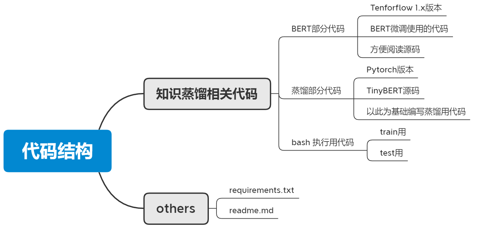
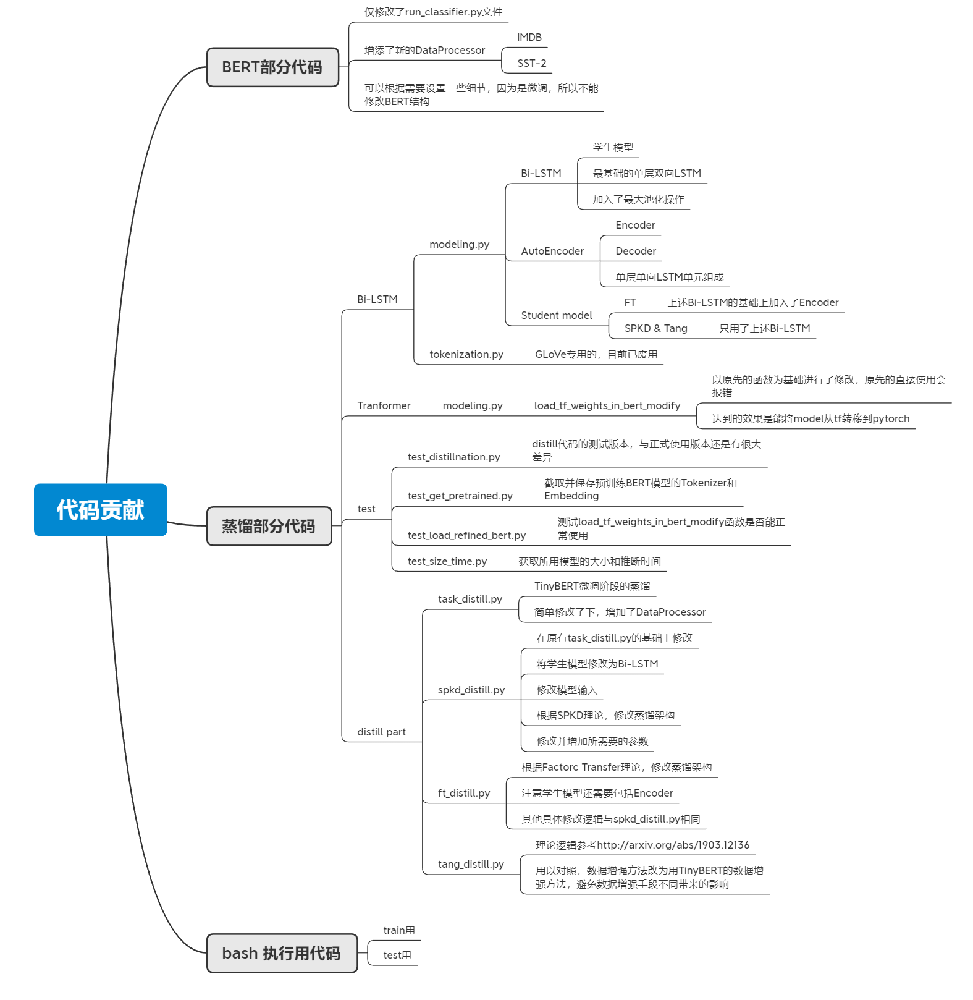

# 知识蒸馏 BERT to Bi-LSTM

## 1. 代码结构

BERT部分的源码来自于[**12/768 (BERT-Base)**](https://storage.googleapis.com/bert_models/2020_02_20/uncased_L-12_H-768_A-12.zip)，

TinyBERT部分的源码来自于[**TinyBERT GITHUB**](https://github.com/huawei-noah/Pretrained-Language-Model/tree/master/TinyBERT)

## 2. 代码部分的贡献

 值得注意的点：

* 原先Bi-LSTM接入的是GLoVe作为Embedding，所以单独写了Tokenizer，后面发现GLoVe.6B的词库都有40万，极大增加了模型大小，所以废用了
* 最初微调BERT的时候用的是TensorFlow版本的代码，得到结果后，才知道TinyBERT用的是Pytorch版本。一个是因为之前微调BERT是在mist网站上租服务器跑的，花了很多时间和金钱，不想重新来，二个是本人能力问题没法短时间修改TinyBERT源码到TensorFlow，且我个人更加熟悉Pytorch，所以才有了想把tf版本的微调BERT参数load到Pytorch中这一多此一举的想法。虽然TinyBERT源码中有load_tf_weights_in_bert函数就负责这个功能，但具体使用后发现问题很多，所以单独写了一个load_tf_weights_in_bert_modify函数
* tang的蒸馏版本并没有用它自己的数据增强手段，防止数剧增强手段不同带来的额外影响

## 3. 结果部分

**表1 模型性能**

|                                        | SST-2 |    IMDB     |
| -------------------------------------- | :---: | :---------: |
| **#**    Model                         |  ACC  | $F_1$ / ACC |
| 1     $BERT_{base}$                    | 91.5  |  92.1/92.0  |
| 2    TinyBERT                          | 90.9  |  90.5/90.7  |
| 3     Bi-LSTM without  Distillnation   | 85.8  |  86.7/86.9  |
| 4     Distilled  Bi-LSTM(Tang)         | 88.3  |  89.0/89.3  |
| 5     FT plan for Distilled Bi-LSTM    | 86.2  |  87.0/87.1  |
| 6     SPKD plan for Distilled  Bi-LSTM | 89.0  |  89.8/89.7  |

 

**表2** **模型性能对比**

| Model                   | Dataset | Bi-LSTM | Distilled Bi-LSTM(Tang) | FT plan | SPKD plan | TinyBERT |
| ----------------------- | ------- | ------- | ----------------------- | ------- | --------- | -------- |
| Bi-LSTM                 | IMDB    | 0%      | -2.6%                   | -0.3%   | -3.5%     | -4.2%    |
|                         | SST-2   | 0%      | -2.8%                   | -0.5%   | -3.6%     | -5.6%    |
| Distilled Bi-LSTM(Tang) | IMDB    | +2.7%   | 0%                      | +2.3%   | -0.9%     | -1.7%    |
|                         | SST-2   | +2.9%   | 0%                      | +2.4%   | -0.8%     | -2.9%    |
| FT plan                 | IMDB    | +0.3%   | -2.2%                   | 0%      | -3.1%     | -3.9%    |
|                         | SST-2   | +0.5%   | -2.4%                   | 0%      | -3.1%     | -5.1%    |
| SPKD plan               | IMDB    | +3.5%   | +0.9%                   | +3.2%   | 0%        | -0.8%    |
|                         | SST-2   | +3.7%   | +0.8%                   | +3.2%   | 0%        | -2.1%    |
| TinyBERT [4]            | IMDB    | +4.4%   | +1.7%                   | +4.0%   | +0.8%     | 0%       |
|                         | SST-2   | +5.9%   | +2.9%                   | +5.5%   | +2.1%     | 0%       |

 

**表3 参数量与推理时间**

| **#**    Model      | # of Par. | Inference Time |
| ------------------- | --------- | -------------- |
| 1     $BERT_{base}$ | 110M (5X) | 264s (18X)     |
| 2     TinyBERT      | 68M (3X)  | 134s (9X)      |
| 3     Bi-LSTM       | 23M (1X)  | 15s (1X)       |

## 4. 总结

自认为项目还有很多待深挖的部分，因为就业和时间问题，目前暂止于此，麻烦大家批评指正